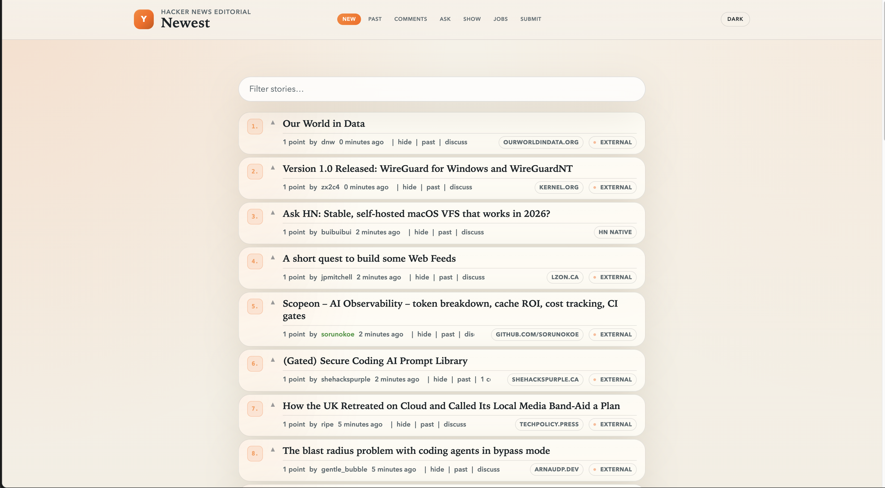

# Hacker News Editorial Redesign

A Manifest V3 Chrome extension that injects a visual redesign into the Hacker News DOM.



## What It Does

- replaces the original header with a fixed top bar
- turns the post list into more readable editorial-style cards
- improves contrast, spacing, and typographic hierarchy
- applies the style to discussion, comment, favorites, and submit pages
- light/dark theme toggle with system preference detection
- client-side story filter search

## Structure

```text
manifest.json
src/content.js
```

## How To Install In Chrome

1. Open `chrome://extensions`
2. Enable `Developer mode`
3. Click `Load unpacked`
4. Select this project folder:

```text
/Users/matheuspuppe/Desktop/Projetos/redesign-hacker-news
```

## How It Works

Chrome injects `src/content.js` into `https://news.ycombinator.com/*`. The script uses the existing Hacker News DOM as its base and reapplies layout, colors, and navigation without requiring any build step.
