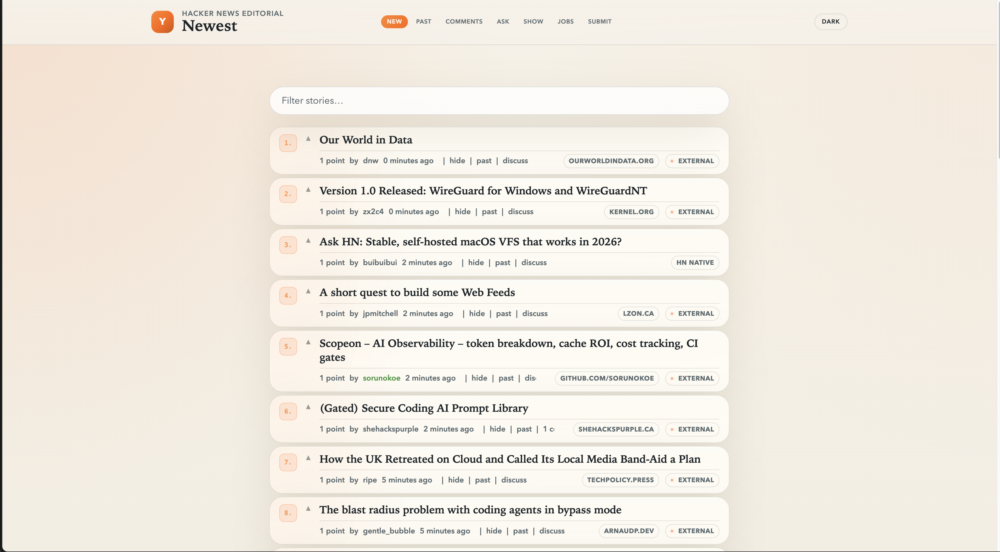

# Hacker News Editorial Redesign

A Manifest V3 Chrome extension that injects a visual redesign into the Hacker News DOM.



## What It Does

- replaces the original header with a fixed top bar
- turns the post list into more readable editorial-style cards
- restores comment-thread indent on discussion pages
- typography modal (Aa) for typeface and reading size
- light/dark theme toggle with system preference detection
- client-side story filter search

## Structure

```text
manifest.json
src/constants.js
src/theme.js
src/type-settings.js
src/boot.js
src/styles/*.css
src/pages/*.js
tests/
```

Chrome injects CSS then JS from `manifest.json`. There is no build step.

## How To Install In Chrome

1. Open `chrome://extensions`
2. Enable `Developer mode`
3. Click `Load unpacked`
4. Select this project folder

## Commands

```text
node --test tests/*.test.js
node --check src/*.js src/pages/*.js
```

## How It Works

Content scripts restyle the existing Hacker News tables. Theme and typography preferences persist in `localStorage`.
